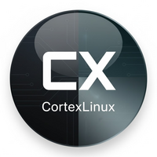

<!-- Improved compatibility of back to top link: See: https://github.com/othneildrew/Best-README-Template/pull/73 -->
<a name="readme-top"></a>

<!-- PROJECT SHIELDS -->
[![Contributors][contributors-shield]][contributors-url]
[![Forks][forks-shield]][forks-url]
[![Stargazers][stars-shield]][stars-url]
[![Issues][issues-shield]][issues-url]
[![MIT License][license-shield]][license-url]
[![Discord][discord-shield]][discord-url]

<!-- PROJECT LOGO -->
<br />
<div align="center">
  <a href="https://github.com/cortexlinux/cortex">
    
  </a>

  <h3 align="center">Cortex Linux</h3>

  <p align="center">
    An AI-powered package manager that understands what you actually want to install.
    <br />
    <a href="https://cortexlinux.com/docs"><strong>Explore the docs »</strong></a>
    <br />
    <br />
    <a href="https://cortexlinux.com/beta">View Demo</a>
    ·
    <a href="https://github.com/cortexlinux/cortex/issues">Report Bug</a>
    ·
    <a href="https://github.com/cortexlinux/cortex/issues">Request Feature</a>
  </p>
</div>

<!-- TABLE OF CONTENTS -->
<details>
  <summary>Table of Contents</summary>
  <ol>
    <li>
      <a href="#about-the-project">About The Project</a>
      <ul>
        <li><a href="#built-with">Built With</a></li>
      </ul>
    </li>
    <li>
      <a href="#getting-started">Getting Started</a>
      <ul>
        <li><a href="#prerequisites">Prerequisites</a></li>
        <li><a href="#installation">Installation</a></li>
      </ul>
    </li>
    <li><a href="#usage">Usage</a></li>
    <li><a href="#safety-features">Safety Features</a></li>
    <li><a href="#roadmap">Roadmap</a></li>
    <li><a href="#contributing">Contributing</a></li>
    <li><a href="#bounties">Bounties</a></li>
    <li><a href="#license">License</a></li>
    <li><a href="#contact">Contact</a></li>
    <li><a href="#acknowledgements">Acknowledgements</a></li>
  </ol>
</details>

<!-- ABOUT THE PROJECT -->
## About The Project

[![Cortex Screen Shot][product-screenshot]](https://cortexlinux.com)

Stop memorizing package names. Just tell Cortex what you want.

```bash
$ cortex install "full ML stack for my RTX 4090"

🔍 Detected: NVIDIA RTX 4090 (24GB VRAM)
📦 Installing: CUDA 12.3, cuDNN, PyTorch 2.1, TensorFlow...
⚡ Optimized for your GPU
✅ Done in 4m 23s
```

Here's why Cortex exists:

* **Natural language** — Say "install docker" not `apt install docker.io docker-compose docker-buildx`
* **Hardware-aware** — Automatically detects your GPU, CPU, and RAM to optimize installations
* **Safe by default** — Every command shows a preview before execution. Nothing runs without your approval.
* **Undo mistakes** — Full transaction history with rollback capability

Cortex wraps apt/dpkg with an AI layer that translates intent into action, while keeping you in control.

<p align="right">(<a href="#readme-top">back to top</a>)</p>

### Built With

* [![Python][Python-badge]][Python-url]
* [![Ubuntu][Ubuntu-badge]][Ubuntu-url]
* [![Claude][Claude-badge]][Claude-url]
* [![LangChain][LangChain-badge]][LangChain-url]

<p align="right">(<a href="#readme-top">back to top</a>)</p>

<!-- GETTING STARTED -->
## Getting Started

Get Cortex running on your Debian/Ubuntu system in under 2 minutes.

### Prerequisites

* Ubuntu 22.04+ or Debian 11+
* Python 3.11+
* An Anthropic API key ([get one here](https://console.anthropic.com))

### Installation

**One-liner install (coming soon):**
```bash
curl -fsSL https://cortexlinux.com/install.sh | bash
```

**Manual install:**

1. Clone the repo
   ```bash
   git clone https://github.com/cortexlinux/cortex.git
   cd cortex
   ```

2. Create virtual environment
   ```bash
   python3 -m venv venv
   source venv/bin/activate
   ```

3. Install dependencies
   ```bash
   pip install -e .
   ```

4. Set your API key
   ```bash
   export ANTHROPIC_API_KEY='your-api-key-here'
   ```

5. Run Cortex
   ```bash
   cortex install docker
   ```

<p align="right">(<a href="#readme-top">back to top</a>)</p>

<!-- USAGE EXAMPLES -->
## Usage

### Basic Installation
```bash
# Natural language
cortex install "web development tools"

# Direct package
cortex install nginx

# Multiple packages
cortex install "docker, nodejs, and postgresql"
```

### Dry Run (Preview Mode)
```bash
# See what would happen without executing
cortex install tensorflow --dry-run
```

### Search Packages
```bash
# Fuzzy search
cortex search "video editor"
```

### Transaction History
```bash
# View what Cortex has done
cortex history

# Undo last operation
cortex undo
```

### Hardware Detection
```bash
# See what Cortex knows about your system
cortex hardware
```

_For more examples, please refer to the [Documentation](https://cortexlinux.com/docs)_

<p align="right">(<a href="#readme-top">back to top</a>)</p>

<!-- SAFETY FEATURES -->
## Safety Features

| Feature | Description |
|---------|-------------|
| **Dry-run mode** | Preview all commands before execution |
| **Transaction log** | Every operation is recorded with undo capability |
| **Firejail sandbox** | Optional sandboxing for untrusted packages |
| **Confirmation prompts** | Nothing executes without explicit approval |
| **Rollback support** | Integration with Timeshift/Snapper snapshots |

<p align="right">(<a href="#readme-top">back to top</a>)</p>

<!-- ROADMAP -->
## Roadmap

- [x] Natural language to apt translation
- [x] Hardware detection (GPU, CPU, RAM)
- [x] Dry-run mode
- [x] Firejail sandboxing
- [ ] Interactive fuzzy search (fzf integration)
- [ ] One-liner install script
- [ ] Offline mode with semantic caching
- [ ] Local LLM fallback (Ollama)
- [ ] System snapshot integration
- [ ] Web dashboard

See the [open issues](https://github.com/cortexlinux/cortex/issues) for a full list of proposed features and known issues.

<p align="right">(<a href="#readme-top">back to top</a>)</p>

<!-- CONTRIBUTING -->
## Contributing

Contributions make the open source community amazing. Any contributions you make are **greatly appreciated**.

1. Fork the Project
2. Create your Feature Branch (`git checkout -b feature/AmazingFeature`)
3. Commit your Changes (`git commit -m 'Add some AmazingFeature'`)
4. Push to the Branch (`git push origin feature/AmazingFeature`)
5. Open a Pull Request

See `CONTRIBUTING.md` for detailed guidelines.

<p align="right">(<a href="#readme-top">back to top</a>)</p>

<!-- BOUNTIES -->
## Bounties

We pay contributors for merged PRs. 💰

| Tier | Current | After Funding |
|------|---------|---------------|
| Quick fix | $25 | +$25 bonus |
| Small feature | $50 | +$50 bonus |
| Medium feature | $75-100 | +$75-100 bonus |
| Large feature | $150-175 | +$150-175 bonus |

**Early contributors get double** — when we close funding, all previous bounties receive a matching bonus.

See issues labeled [`bounty`](https://github.com/cortexlinux/cortex/labels/bounty) to get started.

<p align="right">(<a href="#readme-top">back to top</a>)</p>

<!-- LICENSE -->
## License

Distributed under the MIT License. See `LICENSE` for more information.

<p align="right">(<a href="#readme-top">back to top</a>)</p>

<!-- CONTACT -->
## Contact

Mike Morgan - [@mikejmorgan_ai](https://twitter.com/mikejmorgan_ai)

Project Link: [https://github.com/cortexlinux/cortex](https://github.com/cortexlinux/cortex)

Discord: [https://discord.gg/cortexlinux](https://discord.gg/uCqHvxjU83)

<p align="right">(<a href="#readme-top">back to top</a>)</p>

<!-- ACKNOWLEDGEMENTS -->
## Acknowledgements

* [Anthropic Claude](https://anthropic.com) - AI backbone
* [LangChain](https://langchain.com) - LLM orchestration
* [Rich](https://github.com/Textualize/rich) - Terminal formatting
* [Firejail](https://firejail.wordpress.com) - Sandboxing
* [Best-README-Template](https://github.com/othneildrew/Best-README-Template) - This README structure

<p align="right">(<a href="#readme-top">back to top</a>)</p>

<!-- MARKDOWN LINKS & IMAGES -->
[contributors-shield]: https://img.shields.io/github/contributors/cortexlinux/cortex.svg?style=for-the-badge
[contributors-url]: https://github.com/cortexlinux/cortex/graphs/contributors
[forks-shield]: https://img.shields.io/github/forks/cortexlinux/cortex.svg?style=for-the-badge
[forks-url]: https://github.com/cortexlinux/cortex/network/members
[stars-shield]: https://img.shields.io/github/stars/cortexlinux/cortex.svg?style=for-the-badge
[stars-url]: https://github.com/cortexlinux/cortex/stargazers
[issues-shield]: https://img.shields.io/github/issues/cortexlinux/cortex.svg?style=for-the-badge
[issues-url]: https://github.com/cortexlinux/cortex/issues
[license-shield]: https://img.shields.io/github/license/cortexlinux/cortex.svg?style=for-the-badge
[license-url]: https://github.com/cortexlinux/cortex/blob/main/LICENSE
[discord-shield]: https://img.shields.io/discord/1234567890?style=for-the-badge&logo=discord&logoColor=white
[discord-url]: https://discord.gg/uCqHvxjU83
[product-screenshot]: images/screenshot.png
[Python-badge]: https://img.shields.io/badge/Python-3776AB?style=for-the-badge&logo=python&logoColor=white
[Python-url]: https://python.org
[Ubuntu-badge]: https://img.shields.io/badge/Ubuntu-E95420?style=for-the-badge&logo=ubuntu&logoColor=white
[Ubuntu-url]: https://ubuntu.com
[Claude-badge]: https://img.shields.io/badge/Claude-191919?style=for-the-badge&logo=anthropic&logoColor=white
[Claude-url]: https://anthropic.com
[LangChain-badge]: https://img.shields.io/badge/LangChain-121212?style=for-the-badge&logo=chainlink&logoColor=white
[LangChain-url]: https://langchain.com
